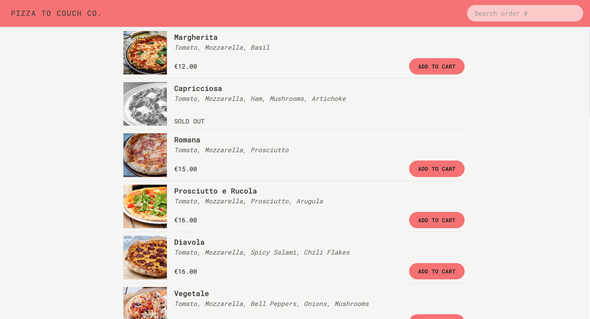

  <h1 align="center">Pizza to Couch Co.</h1>

  

		<h3>
			<a href="https://pizzatocouchco.netlify.app/">
				Demo
			</a>
			 | 
			<a href="https://github.com/GloBoiVic/Pizza-to-Couch-Co">
				Github Repo
			</a>
		</h3>
	

## :page_facing_up: About The Project

A stunning pizza ordering application built with React, Tailwindcss, React-Router-Dom, Redux and bundled with vite!

## :computer: Built With

![React][Reactjs-shield]
![Tailwindcss][Tailwindcss-shield]

## :bust_in_silhouette: Contact

- [LinkedIn](https://www.linkedin.com/in/developing-vic/) - please reach out to me! I want to connect with other developers!

<!-- MARKDOWN LINKS & IMAGES -->

[Reactjs-shield]: https://img.shields.io/badge/React-20232A?style=for-the-badge&logo=react&logoColor=61DAFB
[Tailwindcss-shield]: https://img.shields.io/badge/Tailwind_CSS-38B2AC?style=for-the-badge&logo=tailwind-css&logoColor=white
